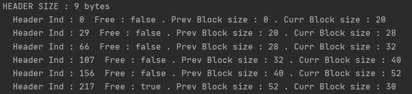
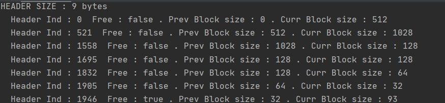
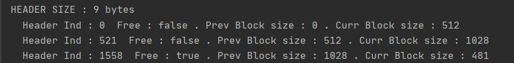
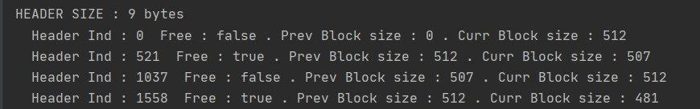

# Allocator
This is a Java implementation of **General-purpose allocator** . 
The main idea of allocator is to correctly allocate and free memory .Our memory divides into blocks with headers.Every block has a header with information about this block.Now i will describe the structure of **Header**
##Header Structure

Size of Header - 9 byte
- isOccupiedBlock(1 byte) - shows if this block is free for work.
- prevBlockSize(4 bytes) - shows previous block size
- currentBlockSize(4 bytes) - shows current  size of  block.

##Methods descriptions   
`void* mem_alloc(size_t size)` 
This function looks for a suitable block to
 place a new memory location in it. 
 If there is no such block, then the method returns ***null***. 
 If it was found, then return the address of the beginning of the block for further work with it.
 
 `mem_free(void* addr)`
 
 
This function  free the memory area at the given index . 
Also, the main task of this method is merging with other free blocks in order to avoid memory fragmentation

`void* mem_realloc(void* addr, size_t size)`

This method is needed to increase or decrease the block length. 
In the first case, if we want to increase the length, 
then using the `mem_alloc` function we are looking for a
 suitable memory location to allocate the necessary block.
  After that, the function is called to free the memory of the old block.
  
 #Usage
 ###Create allocator with 256 bytes memory and fill .    
 ```  
 Allocator allocator = new Allocator(256);
allocator.memAlloc(20);
allocator.memAlloc(26);
allocator.memAlloc(32);
allocator.memAlloc(40);
allocator.memAlloc(50);
```
Result :    

###Free memory

```
Allocator allocator = new Allocator(2048);
 int index0 = allocator.memAlloc(512);
 int index1 = allocator.memAlloc(1028);
 int index2 = allocator.memAlloc(128);
 int index3 = allocator.memAlloc(128);
 nt index4 = allocator.memAlloc(64);
 int index5 = allocator.memAlloc(32);
      
```
Allocation :     

```
 allocator.memFree(index0);
 allocator.memFree(index1);
 allocator.memFree(index2);
 allocator.memFree(index3);
 allocator.memFree(index4);
 allocator.memFree(index5);
```

Result :     

###Realloc

```
Allocator allocator = new Allocator(2048);
int index0 = allocator.memAlloc(512);
int index1 = allocator.memAlloc(1028);
```  

Allocation :     

Divide the block into two others
```
allocator.memRealloc(index1,512);
```

Result :  


